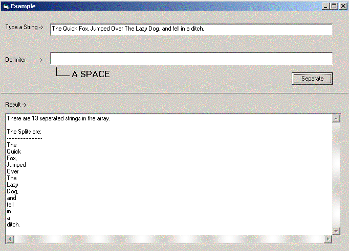

## PHP style string explode function

### Description

This code extracts undetermined-legth-strings (separated by delimiter) from a single string.

NOTE** UPLOADED A NEW EXAMPLE, LAST EXAMPLE HAD A MISTAKE IN IT. SORRY ABOUT THAT.
 
### More Info
 

             |
---                |---
**Submitted On**   |2003-04-21 13:44:36
**By**             |[Bilal Khan](https://github.com/Planet-Source-Code/PSCIndex/blob/master/ByAuthor/bilal-khan.md)
**Level**          |Beginner
**User Rating**    |4.7 (14 globes from 3 users)
**Compatibility**  |VB 6\.0
**Category**       |[String Manipulation](https://github.com/Planet-Source-Code/PSCIndex/blob/master/ByCategory/string-manipulation__1-5.md)
**World**          |[Visual Basic](https://github.com/Planet-Source-Code/PSCIndex/blob/master/ByWorld/visual-basic.md)
**Archive File**   |[PHP\_style\_1577474212003\.zip](https://github.com/Planet-Source-Code/bilal-khan-php-style-string-explode-function__1-44905/archive/master.zip)

### Source Code

This piece of code really comes in handy when storing data (unpredictable in
length) into a file, or Sending data over the net (communication between Client
and Server applications).

For example, You have a client and server app. 

When any of the two applications receive data, you would want to know what to
do with it, therefore you add a header, say 1 alpha character long. Then you
have rest of the data. But what if you need to send two or more strings at the
same time. Like the following example.

The server app. sends a data, which is encrypted, through two values - one
which has been hard-coded, and the other randomly generated whenever the server
broadcasts data to the client (unpredictable in length). 

Now how would the client know the second encryption code?

We have 3 values we need to send to the client, 1- the code to let the client
know what to do with the data  2- The random encryption code 3- The
encrypted data it self(unpredictable in length).

1- d 
2- hfh8i3*&#^ 
3- $&HD&*@#

As I said before, we've assigned the first letter of the broadcast string to
let the client know what to do with it. d (display it), now the encryption code,
normally you would measure how long the encryption code is, and add that length
in front of the encryption, and would do the same with the data. In all, it
takes way too long to code this, and uses too much time to harvest at the client
side, and during the process some where weird errors can occur causing the app
to crash or to read weird inputs.

This is where this code can come in handy.

All the server has to do, is combine all of these three values together
(separated by a delimiter) 

possibly like this: d*|*|*hfh8i3*&#^*|*|*$&HD&*@#

*notice the *|*|* separating the strings. This delimiter can be anything,
from a single character to fairly long string. I suggest using weird patterns
like above to avoid any confusion between the delimiter and the actual data.

Now on the client side all that has to be done is:

Dim args(30) As String 
Dim TotalSplits as Integer 
Dim SockInput as String 
 

Winsock.getdata SockInput 
 
TotalSplits = explodeargs(SockInput, args)

---------

That all there is to it. That statement above will return the following.

TotalSplits = 2 (because starting from 0, 3 is only 2) (this returns the
TOTAL splitable segments.  
                       
And with this you can do a For loop... like:   For i = 0 to
TotalSplits step 1) 
args(0)      = d 
args(1)      = hfh8i3*&#^ 
args(2)      = $&HD&*@#

---------

I hope the example above demonstrated a possible use for this. This isn't all
error proof, or anything big, but sometimes it comes really in handy. 
Below is the code you can place anywhere to use. 
 
Public Function explodeargs(ByVal s,
 ByRef arg()  As String,
 Optional ByVal splitpattern  As String = "*|*|*")
 As Integer 
            On Error Resume Next
 ' on error, just quietly continue on to next operation 
            Dim i 
            For i = 0 To 30
 Step 1  ' assume maximum 30 option strings 
               
arg(i) =  Null ' null everything in the array first 
            Next 
 
            On Error GoTo
ExtractionFinished 
           
For i = 0 To 30  Step 1 
               
arg(i) = Split(s, splitpattern)(i)  ' begin splitting, if an error occurs, then auto exit 
            Next 
 
ExtractionFinished: 
            explodeargs = i - 1 
End Function

